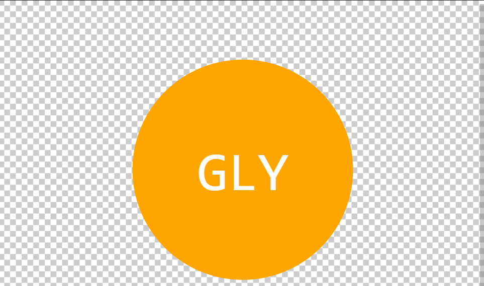

# SVG Generator

The is project is to generate a svg logo that take in three characters, text color, three different shapes, color of the shape. 

## Table of Contents
* [Installation](#installation)
  * [Usage](#usage)
  * [License](#license)
  * [Contributing](#contributing)
  * [Testing](#testing)
  * [Questions](#questions)

<a name="installation"/>

## Installation

Please run "node index.js" from the terminal

<a name="usage"/>

## Usage

The link below is to a video on how to execute the application  and a example logo is also provided.

https://watch.screencastify.com/v/cfSJ1YsBCKpzMh2i75Fu

<a name="license"/>

## License

Copyright 2023-12-08 Greg Yerkes

Permission is hereby granted, free of charge, to any person obtaining a copy of this software and associated 
documentation files (the “Software”), to deal in the Software without restriction, including without limitation 
the rights to use, copy, modify, merge, publish, distribute, sublicense, and/or sell copies of the Software, and 
to permit persons to whom the Software is furnished to do so.

THE SOFTWARE IS PROVIDED “AS IS”, WITHOUT WARRANTY OF ANY KIND, EXPRESS OR IMPLIED, INCLUDING BUT NOT LIMITED 
TO THE WARRANTIES OF MERCHANTABILITY, FITNESS FOR A PARTICULAR PURPOSE AND NONINFRINGEMENT. IN NO EVENT SHALL 
THE AUTHORS OR COPYRIGHT HOLDERS BE LIABLE FOR ANY CLAIM, DAMAGES OR OTHER LIABILITY, WHETHER IN AN ACTION OF 
CONTRACT, TORT OR OTHERWISE, ARISING FROM, OUT OF OR IN CONNECTION WITH THE SOFTWARE OR THE USE OR OTHER 
DEALINGS IN THE SOFTWARE.

<a name="Contributing"/>

## Contributing

<a name="testing"/>

## Testing

please run "npm jest svg.test.js" from the terminal.

<a name="questions"/>

## Questions

[Email me](mailto:gly80@comcast.net)

[Review my other projects on GitHub.](https://www.github.com/gyerkes)

